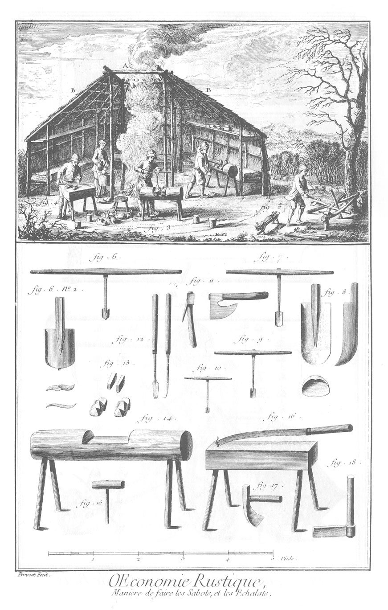

TRAVAIL DES SABOTS, Echalats, &c.
=================================

La vignette représente une cabane de ces sortes d'ouvriers ; elle est construite comme le toît d'une glaciere, & ouverte au sommet A, pour servir de fenêtre & de cheminée. Le comble B B, qui est couvert de paille, est supporté dans son milieu par quatre perches C C C C. On fait du feu en D dans le milieu de la cabane.

1. Ouvrier qui ébauche un sabot avec la cognée.

2. Ouvrier qui perce la place du pied avec la tariere, fig. 6.

3. Ouvrier qui fait la place du talon avec la cuilliere, fig 7. ou 9. ou 10.

4. Ouvrier qui pare les sabots, après que le dedans est achevé; il se sert du paroir, fig. 16.

5. Ouvrier qui fend des échalas ou de la latte avec le coûtre, fig. 18. Les pieces de bois qu'il veut fendre, sont entre les deux fourches du fendoir, qui est une fourche de deux branches d'arbres assujetties horisontalement à la hauteur de deux pieds & demi, lesquelles lui servent d'établi. On voit à côté de lui deux x ou chevalets, sur lesquels Il place les échalas à mesure qu'ils sont fendus, pour les mettre en botte.

6. La tariere, fig. 6. n. 2. Extrémité inférieure de la tariere représentée sur une échelle quadruple.

7. La grande cuilliere de deux pouces de large.

8. Extrémité inférieure de la grande cuilliere, représentée en élévation, profil & plan sur une échelle quadruple.

9. Cuilliere de 18 lignes de large.

10. Cuilliere de 12 lignes de large.

11. Cognée ou hache des sabotiers, vûe de deux sens différens.

12. Rouanne vûe en face & en profil.

13. Calle & coin de bois pour serrer & affermir les sabots non évuidés dans l'encoche.

14. L'encoche ou établi des sabotiers.

15. Maillet qu'on appelle renard, servant à chasser le coin 13 entre deux sabots, pour les faire tenir dans l'encoche.

16. Paroir sur son banc.

17. Essette dont on se sert pour ébaucher au plus près les sabots, après qu'on s'est servi de la hache, fig. 11.

18. Le coûtre pour travailler le bois de fente, comme échalats, lattes, éclisses, &c.

[->](../19-Charbon_de_bois/Légende.md)
