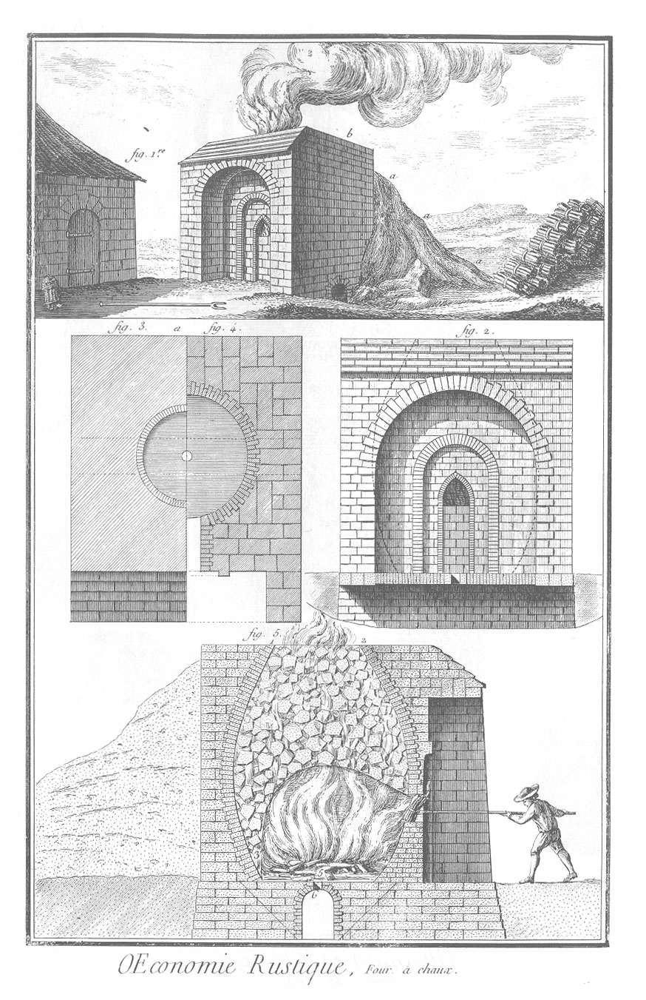

FOUR A CHAUX.
=============

1. Vue d'un four à chaux en dehors & par un de ses angles.

2. Vûe du four à chaux en dehors & de face.

3. &
4. Deux coupes horisontales du four à chaux: l'une prise à la hauteur de l'âtre ; & l'autre, sur l'ouverture supérieure du four.

5. Coupe verticale du four par le milieu de sa gueule, où l'on voit la forme intérieure du four, la disposition des pierres calcaires, la maniere de chauffer le four, avec un ouvrier qui travaille.

Nota. On trouvera dans les Planches VII. & VIII. de la Maconnerie (article Architecture), d'autres détails du four à chaux.

[->](../21-Jardinage/Légende.md)
