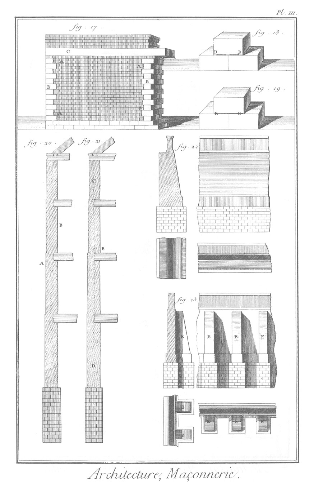

MAÇONNERIE ET PARTIES relatives.
================================

PLANCHE I.ere
-------------

Le haut de la Planche représente des maçons diversement occupés ; les uns A à monter des pierres taillées ; d'autres B sur un échafaud à enduire un mur de plâtre ; d'autres C, à construire un ouvrage de maçonnerie. On voit en D & en E deux tailleurs de pierre ; en F, ceux qui préparent la chaux ; en G, un scieur de pierre ; en H, I, K, les manoeuvres occupés à servir dans la construction des bâtimens.

1. Maçonnerie maillée, que Vitruve appelle reticulatum.
2. &
3. Maçonnerie en liaison, appellée par Vitruve, insertum.
4. &
5. &
6. Maçonnerie de pierres brutes. L'isodomum, le pseudisodomum, & l'emplecton grec.
	- A, les assises.
	- B, les couches de mortier.
	- C, l'enduit de plâtre.
	- D, le garni.
7. Maçonnerie en liaison & cramponnée, ou le revinctum des anciens.
	- E, les pierres cramponées.
	- F, les crampons.
	- G, le garni.
8. Pierres démaigries ou plus creuses en maçonnerie, vers le milieu que par les bords.

PLANCHE II.
-----------

9. Maçonnerie en échiquier.
	- A, angles faits de briques.
	- B, rang de briques, qui tient le mur & le traverse.
	- C, échiquier.
	- D, partie intérieure du mur fait de ciment.
10. Autre maçonnerie en liaison. Deux faces de mur de carreaux de pierre ou de brique ; l'intérieur du mur E est de ciment ou de cailloux de riviere, & soû- tenu de trois piés en trois piés dans sa hauteur par trois lits de brique.
11. Maçonnerie incertaine ou rustique.
	- F, pierres incertaines.
12. Maçonnerie en pierres de taille.
13. Mur de remplage.
14. Autre construction de muraille.
15. Maçonnerie faite de carreaux & boutisses de pierres dures ou tendres, posées en recouvrement les unes sur les autres.
	- A A, carreaux.
	- B, boutisses. Exemples de quelques précautions à observer dans l'art de bâtir.
16. 
	- A, arrachemens.
	- B, chaînes de pierres.
	- C, arcades ou décharges.

PLANCHE III. Suite des précautions à observer dans l'art de bâtir.
------------------------------------------------------------------

17. 
	- A, arrachemens.
	- B, chaînes de pierres.
	- C, poutres.
18. Murs de face & de refends.
	- D, D, pierres callées avec des lattes.
19. 
	- E, E, pierres callées avec des lames de plomb.
20. Mur de face.
	- A, taluds ou retraites données en dehors.
	- B, à plomb du dedans.
21. Murs de face avec taluds ou retraites en-dehors & en-dedans.
	- B, retraites.
	- C D, axe du mur tombant au milieu de sa fondation.
22. Murs de terrasse.
23. Autres murs de terrasse, fortifiés d'éperons ou contre-forts E, E, E, &c.

PLANCHE IV.
-----------

24. Autres murs de terrasse, avec des contre-forts A en-dehors, & d'autres contre-forts B en-dedans, diagonalement disposés en forme de scie.
25. Les mêmes murs de terrasse, avec des contre-forts en-dehors, semblables à ceux de la figure
24. mais dont les contre-forts du dedans C, C, sont disposés en forme de portions circulaires. Nota. Les outils & les machines à l'usage du maçon & du tailleur de pierre, sont représentés ci- après, Pl. XI. XII. XIII.

PLANCHE V.
----------

26. Coupe de l'ouverture d'une carriere : à la surface sont les engins à tirer la pierre de la carriere.
	- A, A, passages ou rues de la carriere.
	- B B, ouverture de la carriere.
	- Nota. Les outils qui s'employent pour détacher la pierre de la carriere, sont représentés & décrits ci-après, Pl. X.

PLANCHE VI.
-----------

27. 
	- n. 1. Coupe verticale d'un four à brique & à tuile, sur la ligne A B, même fig. n. 3. 27.
	- n. 2. Plan du même four au-dessous du premier plancher.
	- n. 3. Plan pris au rez-de-chaussée.
	- Nota. On trouvera à la suite de ces Planches de Ma- çonnerie trois Planches représentant dans un plus grand détail le four à brique & à tuile, les diverses opérations qui s'y exécutent, & les outils qu'on y employe.
28. Coupe verticale d'un four à plâtre.

PLANCHE VII.
------------

- Suite de la fig. 28. 
	- n. 1. Elévation du four à plâtre.
	- n. 2. Plan du même four. Nota. A la suite de ces Planches de la Maçonnerie ; on trouvera dans un plus grand détail une Planche représentant les différentes opérations & les outils du carrier-plâtrier.

29. 
	- n. 1. Coupe verticale d'un four à chaux, prise sur la ligne A B de la même figure à la Planche suivante.
	- n. 2. Elévation du même four.

PLANCHE VIII.
-------------

- Suite de la fig. 29. Plan du four à chaux.

30. &
31. Bassins A B, destinés à la préparation de la chaux, pour être employée dans la maçonnerie. C, communication du bassin supérieur A au bassin inférieur B; elle est garnie d'une grille. Nota. L'exploitation de la pierre à chaux ayant été considérée par ceux qui ont traité la partie de l'Agriculture, comme appartenante à l'Economie rustique, on trouvera dans cette partie une Planche représentant les différens détails d'un four à chaux ; & cela ne doit pas être regardé comme un double emploi, parce que ce four devoit être traité aussi, mais sous un autre point de vûe, par celui qui a été chargé de la maçonnerie.

PLANCHE IX. Fondemens.
----------------------

32. &
33. Maniere de fonder par les piles.
	- A, les piles.
	- B, le bon fond.
	- C, C, C, fig. 32. arcs bandés sur les piles.
	- C, C, C, fig. 33. ares renversés.
34. &
35. Maniere de fonder sur le roc.
	- A A, le roc.
	- B, B, piles élevées, ou maçonneries adossées.
	- C, fig. 34. assises pratiquées par ressaut au roc.
	- C, C, fig. 35. harpes des pierres, & arrachemens pratiqués au rocher.
36. Maniere de fonder par les pierrées.
	- A A A, le roc.
	- B B, C C, E E, cloisons de charpente.
	- D, D, les bords inférieurs de cette cloison.
37. La même maniere de fonder par les pierrées avec une seule cloison, quand le roc est escarpé.
	- A, le roc.
	- B, espace entre le roc & la maçonnerie, qu'on remplit de pierrées.
	- C, cloison,
	- D, maçonnerie.
38. Fondation par arcades, dans les cas où l'on veut économiser.
	- A A, le roc.
	- C, C, massif3.
	- B, B, les arcades.
	- D, D, retombées des arcades.
39. Fondemens sur la glaise.
	- A, grillages de charpente.
	- B, longrines.
	- C, traversines.
40. Fondemens sur le sable.
	- A, tranchée.
	- B, madriers.
	- C, étrésillons ou pieces de bois qui en font la fonction.

PLANCHE X.
----------

41. Fondemens dans l'eau par le moyen des caissons.
	- A, caissons.
42. Fondemens sur pilotis.
	- A, grillage de charpente.
	- B, planchers de madriers.
	- C, Heurtoirs.
	- D, pilots de remplage.
	- E, pilots de bordage ou de garde.
43. Pilot.
	- A, la pointe.
	- B, la tête avec sa virole.
44. Sabot du pilot ou sa lardoire à quatre branches.
45. Pilots de bordage ou de garde A, entrelacés de pal-planches. B. C, C, C, C, rainures pour les pal-planches.
46. Autre maniere de fonder sur pilotis.
	- A, grillage qu'on employe dans cette maniere de fonder.
47. Cheville à tête perdue pour arrêter le grillage sur les pilots. Outils du carrier. 48. Pince de fer servant de levier.
	- A, la partie ronde.
	- B, la partie quarrée.
49. Autre pince semblable, mais plus petite.
50. Rouleau.
51. Autre rouleau.
52. &
53. Esses.
54. Fer de l'esse, vû du côté de l'oeil.
55. &
56. Masse de fer quarrée, appellée mail, & son fer vû du côté de l'oeil.
57. &
58. Autre masse de fer quarrée, plus petite que la précédente, & vûe du côté de l'oeil seulement, ne s'étant pas trouvé sur la Planche suffisamment de place pour la représenter montée avec son manche.
59. Tire-terre.
60. Fer de tire-terre, vû du côté de l'oeil.
61. Marteau.
62. &
63. Coins.
64. Cric.
	- A, la manivelle.
	- B, le croissant.

65. Bacquet ou plateau.

PLANCHE XI. Outils du maçon & du tailleur de pierre.
----------------------------------------------------

66. Regle de bois.
67. Autre regle de bois.
68. Troisieme regle de bois.
69. Equerre de fer.
70. Fausse équerre de bois.
71. Beuvau concave.
72. Beuvau convexe.
73. Grand compas.
74. Petit compas.
75. Niveau.
76. Autre niveau.
77. Regle d'appareilleur.
78. Coin de fet.
79. Masse de fer, appellée grosse masse.
80. Fer de la grosse masse, vû du côté de l'oeil.
81. Petite masse.
82. Fer de la petite masse, vû du côté de l'oeil.
83. Voyez la fig. 85.
84. Voyez la fig. 86.
85. Têtus.
86. Fers de ces deux têtus.
87. &
88. Autre têtu à démolir, avec son fer.
89. &
90. Marteau à deux pointes, & son fer vû du côté de l'oeil.
91. &
92. Marteau bretelé à pointe, & son fer.
93. &
94. Marteau avec bretelure & hache, & son fer, vû du côté de l'oeil.
95. &
96. Marteau avec hache des deux bouts, & son fer.
97. &
98. Marteau à dégrossir, & son fer.
99. Ciseau large.
100. &
101. Marteau à démolir les cloisons & les murs en plâtre, avec son fer.
102. &
103. Marteau à deux pointes, & son fer.
104. &
105. Marteau quarré d'un côté, & à pointe de l'autre, avec son fer, vû du côté de l'oeil.
106. &
107. Hachette.
108. &
109. Déceintroir.
110. Poinçon.

PLANCHE XII.
------------

111. Maillet.
112. Ciseau à main.
113. Gouge.
114. Riflard sans bretelure.
115. Riflard avec bretelure.
116. Aiguille ou trépan.
117. Rabot de bois.
118. Houe.
119. Drague.
120. Fouet avec son plomb.
121. Rondelle.
122. Crochet sans bretelure.
123. Crochet avec bretelure.
124. Riflard.
125. Truelle.
126. Autre truelle.
127. Autre truelle avec bretelure.
128. Pic.
129. Pic vû du côté de la douille.
130. &
131. Pioche.
132. Pelle.
133. Batte.
134. Hotte.
135. Brouette.
136. Banneau.
137. Oiseau.
138. Auge.
139. Panier d'osier à claire voie.
140. Sas.
141. Bar.
142. Civiere.
143. Scie sans dents.
144. Cuilliere de fer.

PLANCHE XIII.
-------------

145. Scie avec dents.
146. Scie à main avec dents.
147. Demoiselle. A, la masse de fer.
148. Scie à main sans dents.
149. Fiche.
150. Brancard.
151. Bouriquet.
152. Manivelle.
	- A, le boulon de fer qui la traverse.
153. Mouton.
	- A, Pilot.
	- B, billot de bois, vulgairement appellé mouton.
	- C, Cordage.
	- D, poulies.
	- E, sol du mouton. Les pieces assemblées avec celle qu'on nomme sol du mouton, forment la fourchette. Voyez en G (fig. 160.) cette partie.
	- G, montant.
	- H, bras ou liens.
	- I, ranche.
	- K, jambette.
154. Echafaud.
	- A, mur.
	- B, cerches.
	- C, boulins.
	- D, planches.
155. Sonde avec ses pieces.
	- A, le manche.
	- B, B, B, tringles de fer.
	- C, vis.
	- D, douille.
	- E, cuilliere.
	- F, fraise.
156. Chevre.
	- A, treuil.
	- B, cordage.
	- C, lévier.
	- D, poulies.
	- E, bras.
	- F, traverses.
157. Cabestan ou vindas.
	- A, levier.
	- B, treuil.
	- D, cordage.
158. &
159. Leviers ou boulins.
160. & 161, Grueau.
	- A, levier.
	- B, treuil.
	- C, cordage.
	- D, poulie.
	- E, poids.
	- F, sol du grueau.
	- G, fourchette. Les pieces assemblées avec le sol & aboutissantes en L, s'appellent bras.
	- I, jambette.
	- K, ranche, grand & petit.
	- L, sellette.
	- M, poinçon.
	- N, lien.
	- O, moises.
161. La partie supérieure du grueau.
	- A, poinçon.
	- B, sellette.
	- C, fauconneau.
	- D, liens.
	- E, cordage.
	- F, poulie.
162. Grue.
	- B, treuil avec le tambour ou la rue.
	- C, cable.
	- D, poids.
	- E, empatement.
	- F, arbre.
	- G, contre-fiches.
	- H, poinçon.
	- I, ranche ; le pié du ranche traverse la piece appellée soûpente.
	- K, liens.
	- L, les petites moises.
	- M, la grande moise.
	- O, le mamelon du treuil.
	- P, sa lumiere.
163. 
	- B, louve.
	- C, louveteau.
	- D, esse.
164. Ciseau à louver.

[->](../13-Carrier-Plâtrier/Légende.md)
