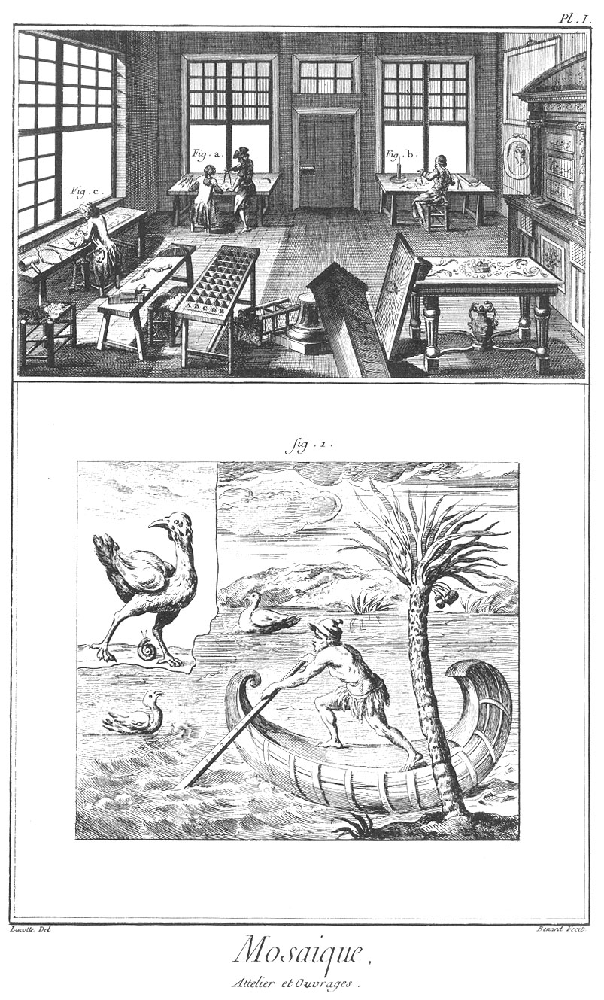
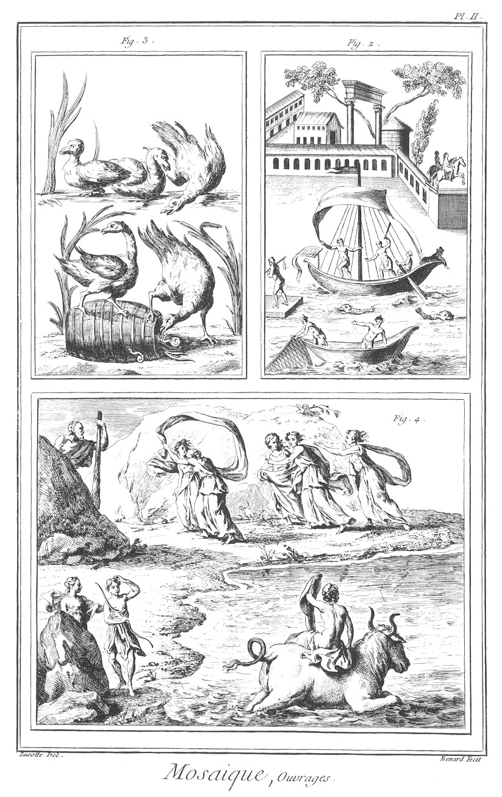
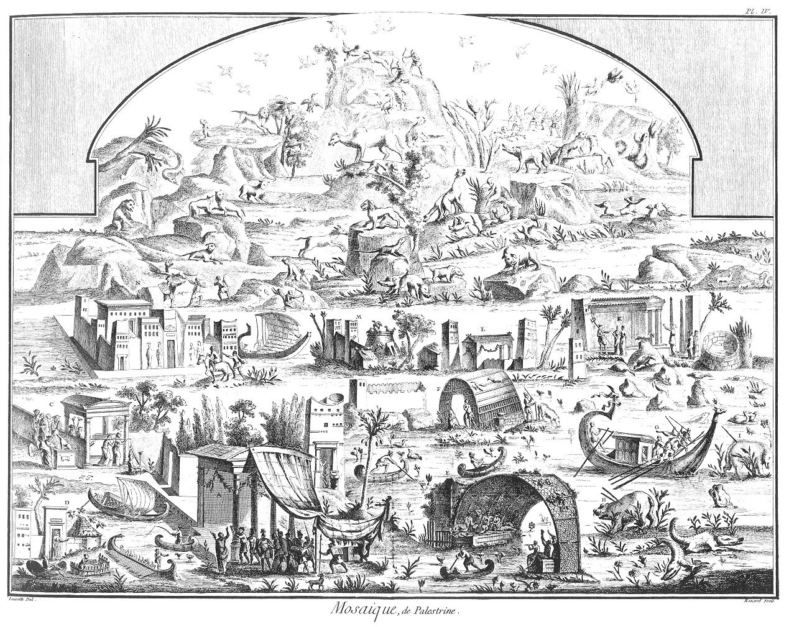
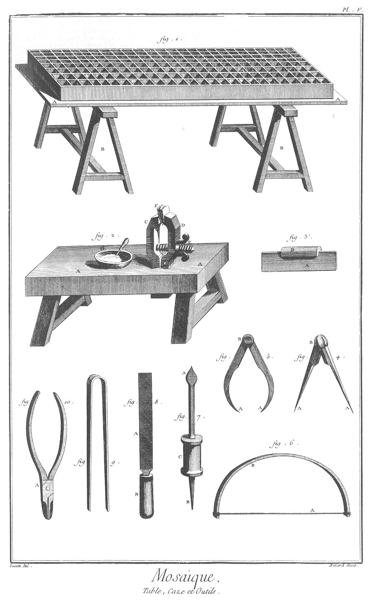

MOSAÏQUE
========

Contenant cinq Planches, équivalentes à six par une Planche double.

PLANCHE Iere.
-------------

Le haut de cette Planche représente un attelier où sont plusieurs ouvriers travaillans à la mosaïque ; les uns a occupés à tracer les petites pieces de marbre selon les endroits où elles doivent être employées, un autre b à les polir & un autre c à les assembler pour en faire des tableaux, portraits, &c. Cet attelier est semé çà & là de différens ouvrages de mosaïque.

La fig.
1. est un paysage représentant un pêcheur sur une barque parcourant les bords du Nil.

PLANCHE II.
-----------

La fig.
2. représente le palais d'un prince souverain, & sur le devant deux barques de pêcheurs.

La fig.
3. représente plusieurs animaux de différentes especes.

La fig.
4. représente l'enlevement d'Europe par Jupiter changé en taureau.

PLANCHE III.
------------

La fig.
5. est une statue tenant en sa main gauche des pavots, symboles du sommeil.

La fig.
6. est une seconde représentation de l'enlevement d'Europe par Jupiter.

La fig.
7. représente trois dauphins, deux écrevisses de mer, un polype, Neptune avec son trident, ou quelqu'autre dieu marin. Au bas de cette figure sont des vestiges de poissons dont un est inconnu, un autre ressemble à un veau marin, & le dernier à un cheval.

PLANCHE IV.
-----------

Cette Planche trouvée en la ville de Palestrine représente une portion de la haute Egypte où le Nil est débordé.

- A est un temple au-dessous duquel est l'empereur Adrien suivi d'officiers & de soldats.
- B semble être la demeure des prêtres de ce temple.
- C est un autre temple où sont des prêtres égyptiens, près desquels est la figure d'Anubis.
- D est la maison d'un pere de famille.
- E représente une fête de l'Egypte, où sont des figures assises sous un berceau chargé de raisin.
- F est une cabanne.
- G sont des égyptiens sur une barque.
- H & I sont des hyppopotames.
- K sont des figures qui semblent être les ministres du temple voisin.
- L est un autre temple.
- M sont deux maisons en tours quarrées, une en tour ronde & deux cabannes.
- N est un grand édifice semblable aux palais d'Egypte. Le haut de cette Planche représente des éthyopiens occupés de la chasse pendant les inondations du Nil.

PLANCHE V.
----------

La fig.
1. est une table avec cases contenant des marbres de différentes couleurs.
	- A est la table qui la soutient, &
	- B B les tréteaux d'assemblage.

La fig.
2. est un établi.
	- A est l'établi.
	- B B en sont les piés d'assemblage.
	- C D E, étaux de bois, dont
		- C est la jumelle dormante,
		- D la jumelle mouvante, &
		- E la vis à écrou.
	- F sont des petits morceaux de marbre.
	- G est la sébille contenant de l'émeril.

La fig.
3. est une petite sciotte.
	- A en est le fer, &
	- B sa monture de bois.

La fig.
4. est un petit compas droit.
	- A A en sont les pointes, &
	- B la tête.

La fig.
6. est un archet ou arçon.
	- A en est la corde, &
	- B l'arc.

La fig.
7. est un trépan.
	- A en est le bout acéré.
	- B la pointe arrondie, &
	- C la boîte.

La fig.
8. est une lime quarrelette.
	- A en est la lime, &
	- B le manche.

La fig.
9. est une pince.

La fig.
10. est une pince différente de cette derniere.
	- A en est la charniere.

[->](../09-Orfevres_Grossier/Légende.md)
