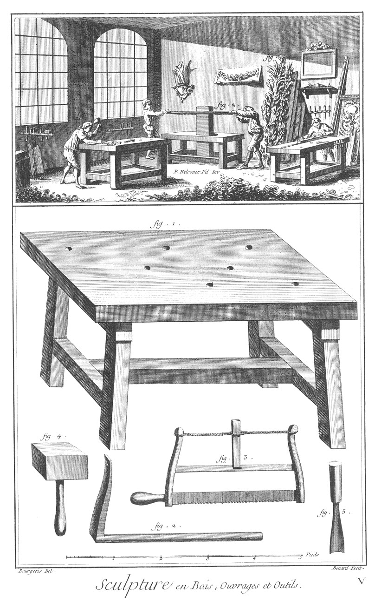

SCULPTURE EN TOUS GENRES: SCULPTURE EN BOIS.
============================================

PLANCHE. Ouvrages & outils.
---------------------------

Vignette.

Fig.
1. Sculpteur qui travaille le bois.

2. Compagnon qui scie une planche.

3. Ouvrier qui travaille avec le rabot.

4. Morceaux de sculpture.

Bas de la Planche.

Fig.
1. Un établi.

2. Valet ; il sert à retenir l'ouvrage sur l'établi.

3. Scie.

4. Maillet.

5. Gouge ou fermoir. Les autres outils sont les mêmes que ceux des sculpteurs en plâtre, comme fermoirs, gouges, ciseaux, &c. &c. &c.

[->](../7-Sculpture_en_Plomb/Légende.md)
