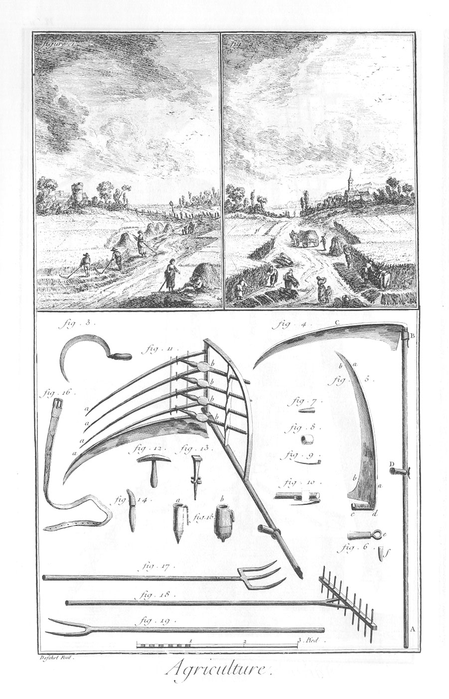

FAÇON DES FOINS, ET MOISSON.
============================

1. Vignette représentant la recolte ou façon des foins.
2. Vignette représentant la moisson.
3. Faucille pour couper ou scier le bled, comme on voit dans la vignette, fig 2.
4. Faulx toute montée pour faucher le foin, représentée dans la vignette premiere. A B, son manche. C, la faulx. D, la main ou poignée.
5. La faulx séparée de son manche.
	- a a, le dos.
	- b b, le tranchant.
	- c d, bras qui sert à attacher la faulx au manche par le moyen d'une virole (fig. 8.) & d'une clavette ou goupille de fer, fig. 7.
6. La main ou poignée garnie de son collet de fer e. f, la clavette qui sert à serrer le collet e sur le manche A B de la faulx, fig. 4.
7. &
8. Virole & clavette de fer pour attacher la faulx au manche, comme on le voit en B, fig. 4. & fig. 10.
9. Coupe de la faulx, pour faire sentir la languette qui regne de a en a sur le dos, fig. 5.
10. Enmanchement de la faulx.
11. Faulx à doigts servant pour l'orge, l'avoine, &c.
	- a a, les doigts.
	- b b, les vis servant à tenir les doigts toujours dans la même direction que la faulx. Les doigts, les vis, &c. sont de bois fort léger, afin de ne point appesantir la faulx.
12. Marteau pour battre le fer de la faulx, & le rendre plus tranchant.
13. Enclume ou tas pour battre le fer de la faulx.
14. Pierre à aiguiser la faulx.
15. Coffin, ou étui à pierre dans lequel on met de l'eau : on en fait de fer blanc, comme (a); & de bois, comme (b).
16. Ceinture de cuir, pour accrocher le coffin au côté du faucheur.
17. Fourche de fer pour charger les bottes sur les voitures.
18. Rateau de bois à deux faces.
19. Fourche de bois.

[->](../05-Batteur_en_grange/Légende.md)
